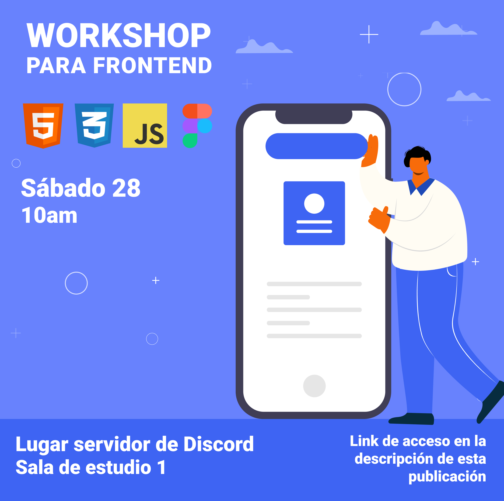

# Wokshop para Frontend 📚

Workshop para la comunidad de discord con el fin de enseñar las herramientas y tecnologías esenciales para crear un landing page.

## Organizadores Colaboradores

[Nicolás](https://github.com/makoto2711) 
[Giovanni](https://github.com/volta2016)

## Lo que vas aprender

- DOM estructura base
- Figma
- Variables Css
- Header, Hero y Animaciones
- Nav
- Grid animaciones
- Javascript manipulando el DOM, creando un Modal
- Footer

## Figma Layout

[Figma Layout](https://www.figma.com/file/EQBLoL6ZqAmjpu5K0kaeHz/taller?node-id=3%3A3)

## Resumen del Workshop puedes verlo acá 📹

[Workshop para Frontend](https://youtu.be/vmQpLWuJeZ8)

## Ver landing page construida acá

[Landing Page](https://workshop-frontenddiscord.netlify.app/)
